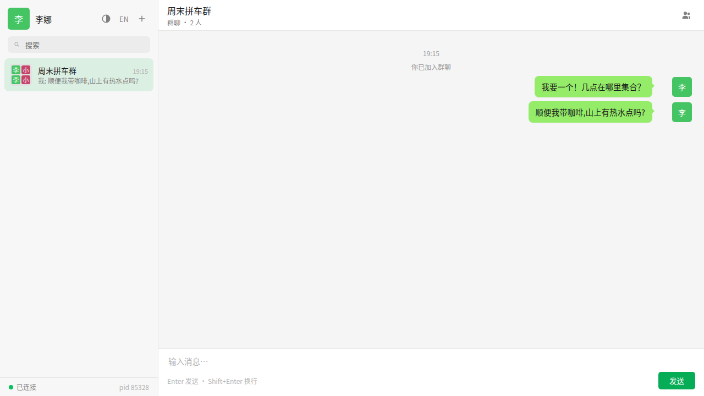

# SHM Chat —— django-channels-shm 演示

[English](README.md) | 中文

一个微信风格的网页聊天室，构建在 [django-channels-shm](../../README.zh.md) 之上，演示该信道层存在的意义：**多进程 ASGI worker 通过 `/dev/shm` 交换消息 —— 无 Redis、无数据库、无任何 broker**（配置里 `DATABASES = {}`）。本演示同时是发布前验收项目：在此目录 `uv sync` 会通过 maturin 从工作树构建库 —— 与正式发布相同的路径。



## 功能

- **登录**：无需注册 —— 选一个不重复的昵称即可进入。
- **私聊**：按昵称发起会话（从在线列表选，或直接输入任意昵称）。
- **群聊**：按群名加入；第一个成员创建群。群人数上限 **500**，由信道层自身强制（`max_members_per_group`）。
- **主题**：工具栏按钮（登录卡片与侧边栏）切换 浅色 / 深色 / 跟随系统；选择记忆在 `localStorage`，首帧绘制前生效。单一色板，按元素经 CSS `light-dark()` 解析 —— `data-theme` 只固定 `color-scheme`。
- **语言**：旁边的 中文 / English 切换。首次访问跟随浏览器语言，选择会被记住；服务端错误消息由客户端按机器可读的 `code` + `params` 就地本地化。
- **多进程**：一个端口，N 个 uvicorn worker；连接由内核随机分配，每条消息都经共享内存层跨进程流转。

## 运行

前提：Linux、Rust 工具链（路径源构建会编译原生模块）、uv。

```bash
cd examples/chat
uv sync                                                   # 经 maturin 从 ../../ 构建 django-channels-shm
uv run uvicorn chat.asgi:application --workers 3 --port 8000
```

在浏览器多个标签页打开 <http://127.0.0.1:8000/> 即可聊天。侧边栏的连接条显示每个标签页由哪个 worker PID 服务；悬停任意消息可见转发它的 worker PID —— 在两个标签页间开一个私聊，看消息在没有 Redis 的情况下跨进程流转。

单 worker 开发模式（自动重载）：

```bash
uv run uvicorn chat.asgi:application --reload --port 8000
```

## 没有存储时它是如何工作的

一切状态都存在信道层的 group 里，因此用标准 Channels API 即可跨 worker 进程工作：

- **昵称唯一性** —— 每个用户加入 group `u_<sha256(nick)>`。新来者向该 group 广播认领；在位者直接向认领者的 channel 应答，客户端据此拒绝新登录。（两个完全同时的认领可能都成功 —— demo 级别可接受。）
- **在线状态** —— 一个共享 group；新客户端广播 census 查询，每个成员直接向它应答。客户端周期性重跑 census，不辞而别的成员会自行掉出列表。
- **私聊消息** —— 恰好一名成员的 group（昵称的 group）。接收方直接向发送者的 channel 回执；客户端在超时后用微信式的红色 `!` 标记未回执消息。
- **群人数 500** —— 由信道层强制：`group_add` 满员时抛出，客户端收到 `group_full` 错误。

## 无头验收（发布清单）

同样的跨进程分发验证，无需浏览器 —— 发布打 tag 前用于验收构建的命令：

```bash
uv run python manage.py demo_broadcast --workers 4 --messages 200
# → "broadcast acceptance PASSED"（任何 shortfall 都以非零退出）
```

## 验收已发布的发布候选

要测试真正发布到 TestPyPI 的产物而非工作树，在 `pyproject.toml` 里把依赖指向 rc：

```toml
[tool.uv.sources]
django-channels-shm = [
    { index = "testpypi", marker = "sys_platform == 'linux'" },
]
```

```toml
[[tool.uv.index]]
name = "testpypi"
url = "https://test.pypi.org/simple"
explicit = true
```

然后 `uv lock && uv sync`（之后改回路径源）。

## 故障排查

- `uv sync` 会编译 Rust —— 先确认 `cargo --version` 可用。
- 容器里 `/dev/shm` 太小？调低 `chat/settings.py` 里的 `shm_size`（demo 配置申请 64 MiB）。
